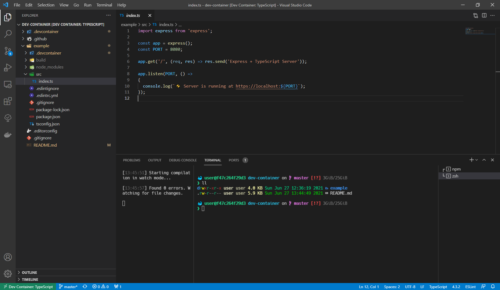

# TypeScript DevContainer Workspace

[](https://github.com/Ealenn/codespaces-typescript/stargazers)
[](https://hub.docker.com/r/ealen/codespaces-typescript/tags)
[](https://hub.docker.com/r/ealen/codespaces-typescript/tags)



The Visual [Studio Code Remote Containers extension](https://code.visualstudio.com/docs/remote/containers) lets you use a Docker container as a full-featured development environment. It allows you to open any folder inside (or mounted into) a container and take advantage of Visual Studio Code's full feature set. 

A `devcontainer.json` file in your project tells VS Code how to access a development container with a well-defined tool and runtime stack. This container can be used to run an application or to separate tools, libraries, or runtimes needed for working with a codebase.

[More information](https://code.visualstudio.com/docs/remote/containers)

> Table of contents

- [TypeScript DevContainer Workspace](#typescript-devcontainer-workspace)
- [Dev-Container](#dev-container)
  - [How to use](#how-to-use)
    - [Environment](#environment)
    - [CLI](#cli)
    - [Libs](#libs)
    - [Essential](#essential)
    - [Others](#others)
  - [How to customize](#how-to-customize)
- [VSCode Extensions](#vscode-extensions)
  - [TypeScript](#typescript)
  - [Files](#files)
  - [Global](#global)
  - [Front](#front)
  - [Theme](#theme)
  - [Docker](#docker)

# Dev-Container

## How to use

In your project, create `.devcontainer/devcontainer.json` [[?]](https://aka.ms/devcontainer.json) : 

``` js
{
  "name": "TypeScript",
  "image": "ealen/codespaces-typescript",

  "extensions": [
    // TypeScript
    "dbaeumer.vscode-eslint",
    "oouo-diogo-perdigao.docthis",
    // Files
    "bungcip.better-toml",
    "yzhang.markdown-all-in-one",
    // Global
    "editorconfig.editorconfig",
    "gruntfuggly.todo-tree",
    "eamodio.gitlens",
    // Front
    "naumovs.color-highlight",
    "octref.vetur",
    // Theme
    "vscode-icons-team.vscode-icons",
    // Docker
    "ms-azuretools.vscode-docker"
  ],

  "settings": {
    "eslint.alwaysShowStatus": true,
    "workbench.iconTheme": "vscode-icons",
    "editor.fontFamily": "Consolas, 'Courier New', monospace, hack, 'Hack Nerd Font Mono'",
    "terminal.integrated.fontFamily": "Consolas, 'Hack Nerd Font Mono'",
    "terminal.integrated.fontSize": 14
  },

  // Use 'forwardPorts' to make a list of ports inside the container available locally.
  // "forwardPorts": [],

  // Uncomment the next line to run commands after the container is created - for example installing curl.
  // "postCreateCommand": "npm ci", // You can also use ZX script or MAKE command

  "mounts": [
    "source=/home/ealen/.ssh,target=/home/user/.ssh,type=bind,readonly",
    "source=/var/run/docker.sock,target=/var/run/docker.sock,type=bind" 
  ]
}
```

An example is available [here](./example).

> /!\ You must install Nerd Font "[Hack Nerd Font Mono](https://github.com/ryanoasis/nerd-fonts/raw/master/patched-fonts/Hack/Regular/complete/Hack%20Regular%20Nerd%20Font%20Complete%20Mono.ttf)" /!\

### Environment 

Based on [Ubuntu 22.04](https://hub.docker.com/_/ubuntu) __

- [ZSH](https://www.zsh.org/) & [Oh-My-ZSH](https://github.com/ohmyzsh/ohmyzsh) Zsh is a shell designed for interactive use, although it is also a powerful scripting language.
- [Starship](https://starship.rs/) The minimal, blazing-fast, and infinitely customizable prompt for any shell!
- [LSD](https://github.com/Peltoche/lsd) Colorizes the ls output with color and icons.

### CLI

- [Vim](https://www.vim.org/) Vim is a highly configurable text editor built to make creating and changing any kind of text very efficient.
- [TheFuck](https://github.com/nvbn/thefuck#installation) The Fuck is a magnificent app, that corrects errors in previous console commands.
- [JQ](https://github.com/stedolan/jq) jq is a lightweight and flexible command-line JSON processor.
- [gi](https://github.com/Ealenn/gi-gitignore-generator) CLI to generate .gitignore or .gitignore_global files
- [ZX](https://github.com/google/zx) Bash is great, but when it comes to writing scripts, people usually choose a more convenient programming language.

### Libs

- [Docker](https://www.docker.com/) & [Docker-Compose](https://docs.docker.com/compose/) Lets you run Docker within Docker.
- [NVM](https://github.com/nvm-sh/nvm) with [Node LTS](https://nodejs.dev/) installed by default. NVM is a version manager for NodeJS.
- [Python3](https://www.python.org) Python is a programming language that lets you work quickly and integrate systems more effectively.

### Essential

- [Git](https://git-scm.com/) Git is a free and open source distributed version control system.
- [Curl](https://curl.se/) Command line tool for transferring data with URLs.
- [Wget](https://www.gnu.org/software/wget/) GNU Wget is a free software package for retrieving files using HTTP, HTTPS, FTP and FTPS.

### Others

- [ca-certificates](https://packages.debian.org/en/sid/ca-certificates) Contains the certificate authorities shipped with Mozilla's browser to allow SSL-based applications to check for the authenticity of SSL connections.
- [gnupg](https://packages.debian.org/en/sid/gnupg) GnuPG is GNU's tool for secure communication and data storage.

## How to customize

Create `.devcontainer/Dockerfile` and extend this codespace :

```dockerfile
FROM ealen/codespaces-typescript

# Add your changes
```

Update your `.devcontainer/decontainer.json` to build your custom image :

```js
{
  "name": "TypeScript",
  "build": {
    "context": ".",
    "dockerfile": "./Dockerfile"
  }
  ...
}
```

# VSCode Extensions

## TypeScript
- [dbaeumer.vscode-eslint](https://marketplace.visualstudio.com/items?itemName=dbaeumer.vscode-eslint) Integrates ESLint JavaScript into VS Code.
- [oouo-diogo-perdigao.docthis](https://marketplace.visualstudio.com/items?itemName=oouo-diogo-perdigao.docthis) Automatically generates detailed JSDoc comments in TypeScript and JavaScript files.

## Files
- [bungcip.better-toml](https://marketplace.visualstudio.com/items?itemName=bungcip.better-toml) Better TOML Language support
- [yzhang.markdown-all-in-one](https://marketplace.visualstudio.com/items?itemName=yzhang.markdown-all-in-one) All you need to write Markdown 

## Global
- [editorconfig.editorconfig](https://marketplace.visualstudio.com/items?itemName=editorconfig.editorconfig) EditorConfig Support for Visual Studio Code
- [gruntfuggly.todo-tree](https://marketplace.visualstudio.com/items?itemName=gruntfuggly.todo-tree) Show TODO, FIXME, etc. comment tags in a tree view
- [eamodio.gitlens](https://marketplace.visualstudio.com/items?itemName=eamodio.gitlens) Supercharge the Git capabilities built into Visual Studio Code

## Front
- [naumovs.color-highlight](https://marketplace.visualstudio.com/items?itemName=naumovs.color-highlight) Highlight web colors in your editor
- [octref.vetur](https://marketplace.visualstudio.com/items?itemName=octref.vetur) Vue tooling for VS Code

## Theme
- [vscode-icons-team.vscode-icons](https://marketplace.visualstudio.com/items?itemName=vscode-icons-team.vscode-icons) Icons for Visual Studio Code

## Docker
- [ms-azuretools.vscode-docker](https://marketplace.visualstudio.com/items?itemName=ms-azuretools.vscode-docker) Makes it easy to create, manage, and debug containerized applications.
